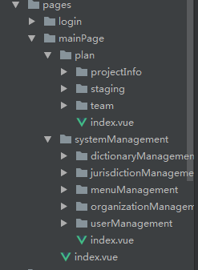
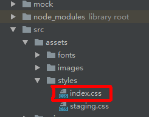
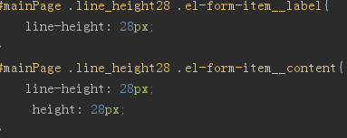
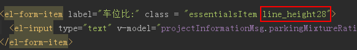
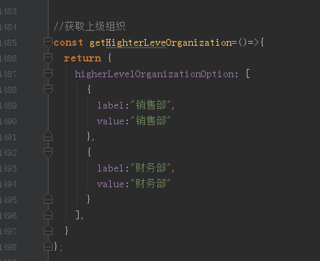
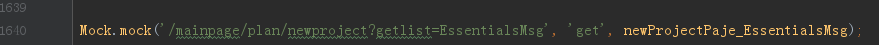
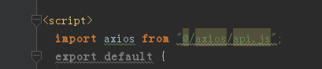
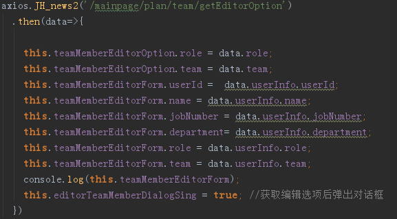
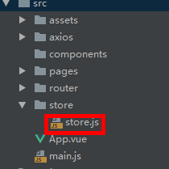

# greentown

> greentown

## Build Setup

``` bash
# install dependencies
npm install

# serve with hot reload at localhost:8088
npm run dev

# build for production with minification
npm run build

# build for production and view the bundle analyzer report
npm run build --report
```

For a detailed explanation on how things work, check out the [guide](http://vuejs-templates.github.io/webpack/) and [docs for vue-loader](http://vuejs.github.io/vue-loader).


一 项目所用框架组成

Vue+element ui+axios+mock(调试)
vue:
	vue-cli+vue-router(2.0)+vuex
element ui:
	引用了全部的组件。
数据交互：
	使用axios。
模拟后台数据调试工具：
	使用mock。

二，当前项目进度

暂时项目没有后端接口，数据以前端mock和临时状态/变量为主。

当前项目已完成功能模块：
系统管理：
（1）：字典管理
（2）：用户管理
（3）：组织管理
（4）：权限管理
（5）：菜单管理
项目准备：
（1）：项目信息
（2）：房源管理
（3）：销售团队

三 项目中自建组件开发说明

此目录为开发人员主要工作区所有页面组件均在此目录下开发。目录结构如下图：

目前项目主要分为两个login和 mainPage两个模块每个模块下的index.vue文件为此模块的根组件。例如上图中所示的在mainpang文件夹下的index.vue文件，由此也可知道在mianpage这个模块下又分为plan和systemManagement两个模块，对应每个文件夹下的index又是这两个模块的根组件以此类推在以后的开发中均以此模式开发。
即：即每个组件建立自己的文件夹，在文件夹下建立index.vue文件为组件实例文件，子组件则在父组件文件夹下再建立自己的文件夹。这样目录文件夹得嵌套关系即为组件的嵌套关系提升代码维护性。


四 现有提取的公共部分的介绍

1.css部分:
共用css文件路径 src/style/index.css 如图所示：

使用方法：
此文件以引入到项目pages/mainPage/index.vue文件中，针对mainpage下的附属组件样式控制。文件中对于element ui 库中的组件样式已做了部分调整例如：控件颜色，字体颜色为项目等，这些部分不需要手动引入使用element ui 组件时会自动匹配。
本公文件对 element UI 的部分组件提供了一些基本尺寸以适应不同的页面需求方便开发。使用时只需在文件中找到这些定义好的样式的二级类名如下图：定义好了el-input组件的高28 px的标准样式

使用示例如下图：

本文件提供了三种可选的input 高度样式分别是
17px :   .line_height17
26px:  .line_height26
28px :  .line_height28
目前修改了样式的公共组件有
1.Form 表单：
	Input：
		Icon
		内容
		Select：选中字体颜色
		级联选择器：选中字体颜色
		Checkbox: 选中颜色

2.分页的当前页码，
3.对话框
	对话框关闭按钮颜色
	按钮移入颜色
4.树状控件
5.按钮
	主按钮
	普通按钮
6.警告框提示按钮

2.Mock文件：
在没有获取后端接口的情况下开发前端程序，建议使用mock模拟后端数据。此文件已在全局引用，使用者不需重复引用。
文件路径：
Mock/mock.js
使用者需在mock文件中定义好自己的接口响应函数及请求地址即可如下图所示：


在需要求情后端数据的时候引入axios实例：

3.Axios：
本项目使用axios实现前后端交互。
文件路径：src/axios/api.js

其中定义了两个函数
post：JH_news(url, params) 带参数
get: JH_news2(url) 不带参数
使用时 引入axios实例即可使用。如下图：

五 其他模块说明
Vuex ：
为解决负责组件间的交互本项目引入了vuex 。但是对于一般开发组件信息传递不建议使用此部分。
路径：src/store/store
Vue-router：
本项路由使用 vue-router 负责项目前端路由配置。
路径：src/router/index.js

六 UI组件

本项目UI组件使用element UI 使用时参考官方文档链接为：http://element.eleme.io/#/zh-CN/

七 开发时UI约定

顶部导航大标题字号：18号
侧边二级导航字号：14号
标题字号：14号
正文12号
按钮文字：12号
操作文字：12号

颜色
线条色、边框色：#E5E5E5
标题文字深色：#404040
提示性文字浅色：#666666
按钮色、操作文字色：#4DBE61
按钮浅色：#DEFFE4
必输* 号色：#E60012
表格选中色：#F7F7F7


